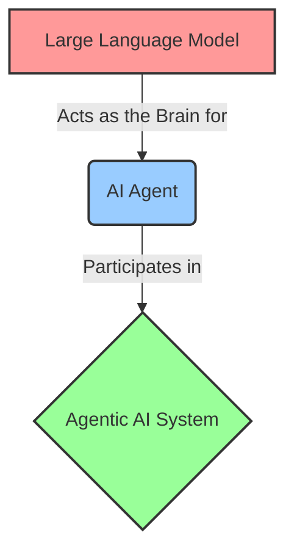

  
# 🧠 AI, LLMs, & Agentic AI: Comprehensive Guide
*A professional, simplified, and detailed overview of Artificial Intelligence concepts.*

---

## 1. Artificial Intelligence (AI)

> [!NOTE] 
> **What is AI?**
> AI is the branch of computer science focused on building machines and software that can perform tasks normally requiring human intelligence. This includes understanding language, recognizing patterns, making decisions, and solving problems.

### 🎯 Core Goals of AI
* **Learn:** Enable machines to learn from data and past experiences.
* **Reason:** Make logical decisions based on available information.
* **Understand:** Process human language, images, and audio seamlessly.
* **Solve & Plan:** Solve complex problems and plan multi-step actions.

### 🆚 AI vs. Traditional Programming

| Feature | Traditional Programming | Artificial Intelligence (AI) |
| :--- | :--- | :--- |
| **Logic** | Programmer writes explicit, rigid rules. | System learns rules and patterns from data. |
| **Flow** | Input + Program $\rightarrow$ Output | Input + Output (Data) $\rightarrow$ Program (Model) is learned. |
| **Adaptability** | Fixed logic; does not adapt to new data. | Continuously adapts and improves with more data. |
| **Best For...** | Well-defined, deterministic tasks. | Pattern recognition, ambiguity, and prediction. |

---

## 2. Large Language Models (LLMs)

> [!TIP]
> **What is an LLM?**
> An LLM is a specialized type of AI model trained on massive amounts of text data. Its primary job is to understand context and generate human-like language by predicting the next most likely word (token) in a sequence.

### 🔍 Decoding the Name
* **Large:** Contains billions of parameters and is trained on internet-scale datasets (books, websites, code).
* **Language:** Specifically designed to process and generate human text.
* **Model:** A mathematical/statistical system mapping inputs to outputs.

### ⚙️ How LLMs Work (Simplified)
1. **Tokens:** Text is broken down into small chunks called *tokens* (e.g., "unhappiness" $\rightarrow$ "un", "happi", "ness").
2. **Embeddings:** These tokens are converted into numbers so the machine can read them.
3. **Processing:** A neural network processes these numbers to understand context and relationships.
4. **Prediction:** The model predicts the *next token* one at a time.
5. **Generation:** This loop repeats until a full, coherent response is formed.

---

## 3. AI Agents

An **AI Agent** goes a step further than an LLM. It is a system that can **perceive** its environment, **reason** about what to do (often using an LLM as its brain), and **take action** to achieve a specific goal.

*A 3D representation of an AI Agent's architecture.*

### 🧩 Core Components of an AI Agent
* **Perception:** The sensory input module (reads user queries, files, APIs).
* **Reasoning (The Brain):** Processes the information and makes decisions (usually an LLM).
* **Planning:** Breaks down a large goal into manageable sub-tasks.
* **Tools:** External functions the agent can use (web search, calculators, code execution).
* **Action:** Executing the planned steps using the tools.
* **Memory:** Stores the context of past actions to inform future decisions.

---

## 4. Agentic AI

> [!IMPORTANT]
> **What is Agentic AI?**
> Agentic AI refers to a broader system of AI that operates with a **high degree of autonomy**. While an AI Agent might do *one* specific task, an Agentic AI system can independently set sub-goals, use multiple tools, and carry out complex, multi-step tasks with minimal human intervention. It continuously adjusts based on feedback.

### ✨ Key Characteristics
* **Goal-Oriented:** Works tirelessly toward a defined end goal rather than just answering a single prompt.
* **High Autonomy:** Operates without needing step-by-step human instructions.
* **Feedback Loops:** Observes the result of its actions and adjusts its plans accordingly (Plan $\rightarrow$ Act $\rightarrow$ Observe $\rightarrow$ Re-plan).

---

## 5. Important Comparisons (Quick Reference)

### Concept Comparisons

| Term A | Term B | Key Difference |
| :--- | :--- | :--- |
| **AI** | **Machine Learning (ML)** | AI is the broad field of intelligent machines. ML is a subset of AI where machines specifically learn from data using statistical algorithms. |
| **AI** | **Generative AI** | AI covers all intelligent systems (prediction, classification). Generative AI is a subset focused purely on *creating* new content (text, images, video). |
| **AI** | **LLM** | AI is the umbrella field (vision, robotics, planning). An LLM is a highly specialized AI model focused *only* on understanding and generating language. |
| **LLM** | **AI Agent** | An LLM is a passive model that responds to text prompts. An AI Agent is an active system that uses an LLM as its brain to use tools and take real-world actions. |
| **Chatbot** | **AI Agent** | Chatbots are reactive and designed just to converse. AI Agents are designed to *complete tasks*, plan, and interact with external systems. |
| **Traditional AI** | **Agentic AI** | Traditional AI performs narrow, single tasks (e.g., classifying an image). Agentic AI performs multi-step, goal-driven tasks autonomously with feedback loops. |

---

## 6. The AI Hierarchy

Understanding how these fields nest within one another is crucial for grasping the modern AI landscape.

*3D Pyramid illustrating the nested fields of Artificial Intelligence.*

### 🔽 Conceptual Hierarchy (Broad $\rightarrow$ Narrow)
1. **Artificial Intelligence (AI):** The overall field of making machines intelligent.
2. **Machine Learning (ML):** Systems learning patterns from data.
3. **Deep Learning (DL):** A subset of ML using multi-layered neural networks.
4. **Generative AI:** A subset of DL focused on generating brand new content.
5. **Large Language Models (LLMs):** A type of Generative AI focused exclusively on human language.

### 🔄 Functional Hierarchy (How They Connect)

* **LLM:** Provides the foundational reasoning and language ability.
* **AI Agent:** Wraps the LLM with perception, tools, and actions to complete a task.
* **Agentic AI System:** The broader environment where multiple agents might collaborate, plan, act, and adapt to achieve massive multi-step goals.
